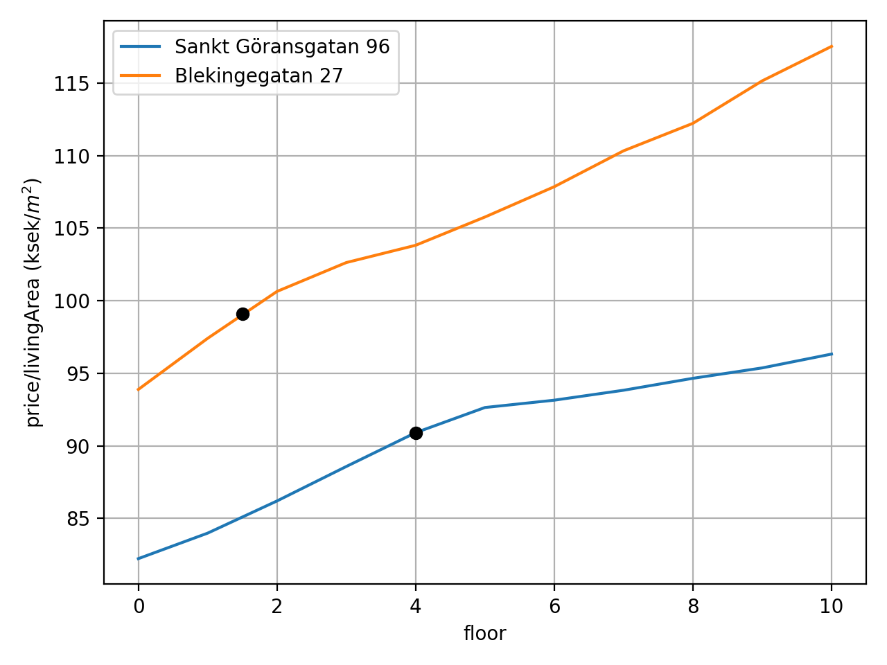

# Apartment prices in Stockholm

Predict apartment prices in Stockholm using machine learning!

<figure>
<div class="row">
  <div class="column">
  
</div>
<figcaption>Apartment prices in Stockholm. All apartment features are the same on the map, except the position.</figcaption>
</figure>

<figure>
<div class="row">
  <div class="column">
  
</div>
<figcaption>Price change for some apartments as function of time.</figcaption>
</figure>

<figure>
<div class="row">
  <div class="column">
  
</div>
<figcaption>Price per m^2 for some apartments as function of apartment size.</figcaption>
</figure>

<figure>
<div class="row">
  <div class="column">
  
</div>
<figcaption>Price per m^2 for some apartments as function of floor number.</figcaption>
</figure>

<figure>
<div class="row">
  <div class="column">
  
</div>
<figcaption>Price per m^2 for some apartments as function of construction year.</figcaption>
</figure>

### How to get started
- View the figures in the `figures` folder.

- Install libraries:
```bash
./install.sh
```

- Activate Python virtual environment and set PYTHONPATH.
```bash
source env.sh
```

- Load a (trained) neural network model, and generate a map of Stockholm with apartment prices color-coded, as well as two videos of how the prices in the region have changed over time:
```bash
./use_model_tf.sh
```

- Edit the python file `use_model_tf.py` to something you are interested in, e.g. add an apartment to be analyzed.

### Tests
Check unit-tests with
```bash
pytest
```

### Documentation
The documentation of this package is found in the directory `docs`.

To update the manual, type:

```bash
cd docs && sphinx-apidoc -f --implicit-namespaces -o . ../apartment_prices && make html
```
to generate a html-page.

