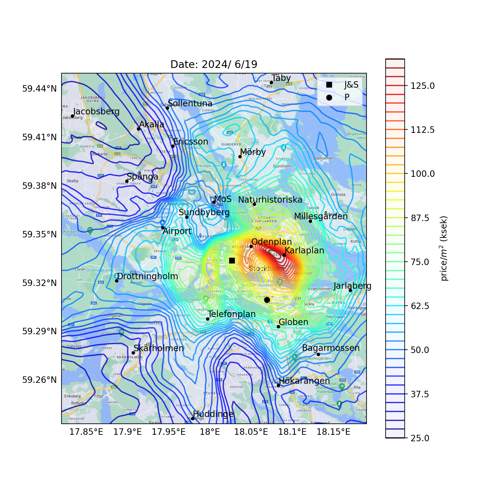
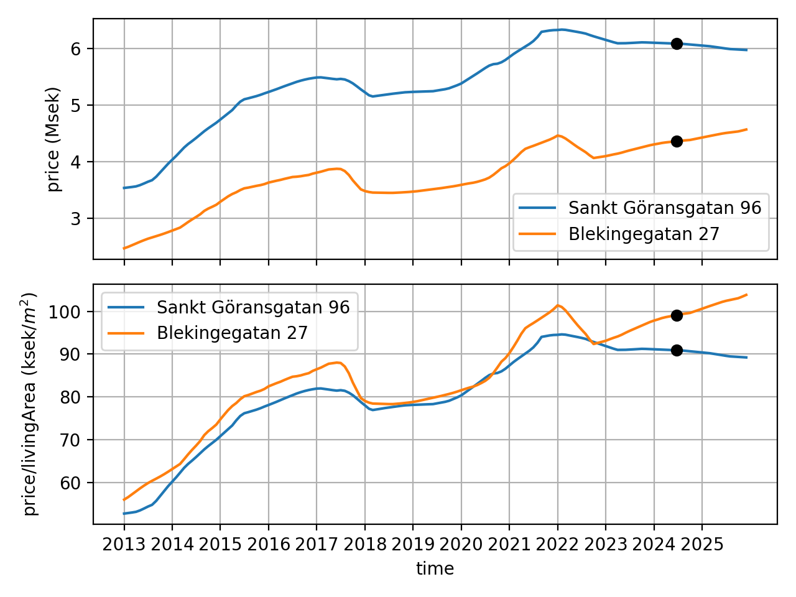

# Apartment prices in Stockholm

Predict apartment prices in Stockholm using machine learning!

<figure>
<div class="row">
  <div class="column">
  
</div>
<figcaption>Apartment prices in Stockholm, for the median apartment in Stockholm.</figcaption>
</figure>

<figure>
<div class="row">
  <div class="column">
  
</div>
<figcaption>Price change for some apartments as function of time.</figcaption>
</figure>

<figure>
<div class="row">
  <div class="column">
  
</div>
<figcaption>Price per m^2 for some apartments as function of apartment size.</figcaption>
</figure>

<figure>
<div class="row">
  <div class="column">
  
</div>
<figcaption>Price per m^2 for some apartments as function of floor number.</figcaption>
</figure>


### How to get started
- View the figures in the `figures` folder.

- Install libraries and setup Python virtual environment with:
```bash
source setup.sh
```

- Load a (trained) neural network model, and generate a map of Stockholm with apartment prices color-coded:
```bash
source use_model_tf.sh
```

- Edit the python file `use_model_tf.py` to something you are interested in.

