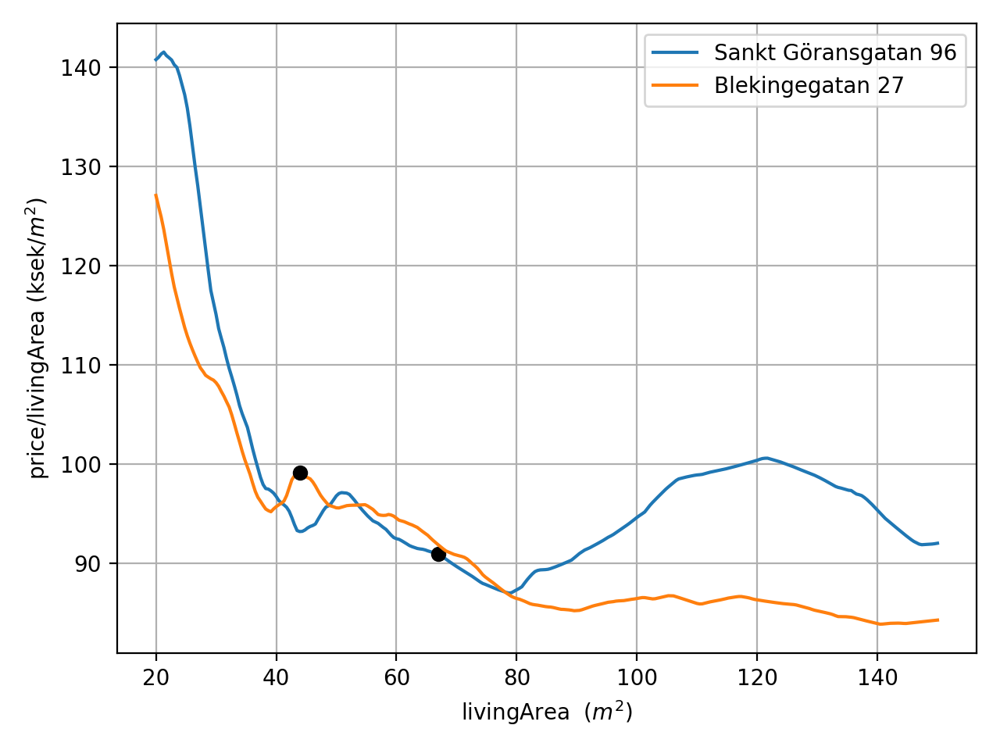

# Apartment prices in Stockholm

Predict apartment prices in Stockholm using machine learning!

<figure>

  

  

<figcaption>Apartment prices in Stockholm, for the median apartment in Stockholm.</figcaption>
</figure>

<figure>

  

  

<figcaption>Price change for some apartments as function of time.</figcaption>
</figure>

<figure>

  

  

<figcaption>Price per m^2 for some apartments as function of apartment size.</figcaption>
</figure>

### How to get started
- View the figures in the `figures` folder.
- Run Python script `use_model.py`.
  This will (hopefully) load a neural network model, which is used to generate a map of Stockholm with the apartment price color-coded for the median apartment of Stockholm.

